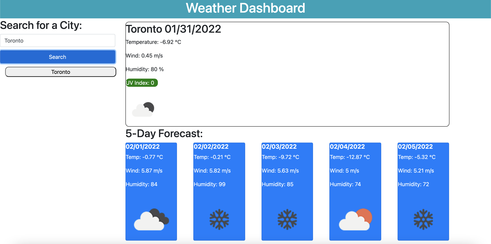

# UofT-SCS-Coding-Bootcamp-Homework-6-Weather-Dashboard

## Description

The purpose of this project was to create a simple weather dashboard. The dashboard take input, city name, from the user, and displays the current conditions, as well as the conditions for the next five days. The app features dynamically updated HTML and CSS powered by JavaScript. The application also uses the Moment.js library to work with date and time. The application uses the OpenWeather API to fetch weather data.

## Installation
 Download the repository and open the index.html. Be sure to download all the files as the javascript will not load if not included in the directory.

## Usage
The following image shows the web application's appearance and functionality.

The application should appear as follows:

## Credits
Uoft SCS Coding Bootcamp Gitlab

## License
Copyright [2021] [Sevag Gaprielian]

Licensed under the Apache License, Version 2.0 (the "License"); you may not use this file except in compliance with the License.
You may obtain a copy of the License at http://www.apache.org/licenses/LICENSE-2.0.

Unless required by applicable law or agreed to in writing, software
distributed under the License is distributed on an "AS IS" BASIS,
WITHOUT WARRANTIES OR CONDITIONS OF ANY KIND, either express or implied.
See the License for the specific language governing permissions and
limitations under the License.

## GitHub and Link to Deployed Application
Github: sevaggap
 
Application: https://sevaggap.github.io/Weather-Dashboard/
